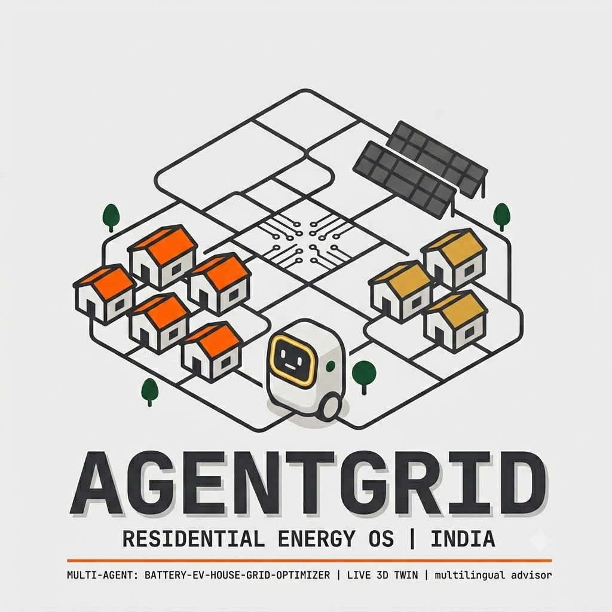

<div align="center">
  

# ⚡ AGENTGRID ⚡

**An Autonomous Multi-Agent Energy Operating System that transforms residential communities into self-optimizing sustainable ecosystems.**

[](https://hackprixs3.vercel.app)
[](https://hackprixs3.vercel.app)
[](#)

</div>

<br/>

## 🏆 Hackathon Details
> **Hackprix Season 3 Hyderabad**  
> **Team Lazy ppl:** Abdul Raheem | Mohammed Abdul Rafe Sajid | Shaikh Abdullah | Akber Hussain

---

## 🌍 The Vision

Traditional energy grids are reactive and central-heavy. **AGENTGRID** reimagines energy distribution as a living, breathing digital organism. By assigning specialized, LLM-powered AI agents to different nodes of a community (Houses, EVs, Solar Farms, Batteries), the system enables real-time negotiation, peer-to-peer energy trading, and autonomous crisis management.

## 🚀 Key Innovations

### 🤖 Multi-Agent LLM Orchestration
At the core of AgentGrid is a society of intelligent agents. Instead of hardcoded rules, these agents use Large Language Models (Groq / Sarwam) to reason about energy states, predict future consumption, and negotiate trades. 
- **🏠 House Agent:** Learns user habits and optimizes appliance usage.
- **☀️ Solar Agent:** Predicts generation based on weather patterns.
- **🔋 Battery Agent:** Buys energy when cheap, sells when demand peaks.
- **🚗 EV Agent:** Ensures the car is charged for morning commutes while acting as a mobile battery at night.
- **🏢 Grid Agent:** Manages the macro-demand and prevents blackouts.

### 🎮 Immersive 3D Digital Twin UI
AgentGrid doesn't just output charts—it provides a stunning **interactive 3D environment** that acts as your window into the ecosystem.
- **Spatial Monitoring:** Pan, zoom, and rotate around the virtual community to inspect individual nodes in real-time.
- **Live Energy Flows:** Visual pulse lines represent the active transfer of energy between houses, the solar farm, and the main grid.
- **Dynamic Scenario Visualization:** Trigger a 'Storm' or 'Heatwave' and watch the UI react with visual effects while agents scramble to preserve battery life and adapt to the crisis.

### 💬 Multilingual Conversational Advisor
Talk directly to your energy grid! Using voice or text, users can interrogate the system:
* *"Why is house 3 consuming so much power?"*
* *"Simulate a heatwave for the next 4 hours and optimize the battery."*

---

## ⚙️ Architecture & Tech Stack

<div align="center">
  
  
  
  
</div>

- **Frontend:** Next.js, React, Tailwind CSS, WebSockets for live data streaming, and dynamic rendering for the 3D digital twin.
- **Backend:** Python, FastAPI, WebSockets.
- **AI/LLMs:** Groq & Sarwam API integration for hyper-fast agent reasoning and multilingual support.

---

## 💻 Get Started Locally

### 1. Clone the repository
```bash
git clone https://github.com/abd-RAHEEM/AGENTGRID.git
cd AGENTGRID
```

### 2. Backend Setup
```bash
cd backend
python -m venv venv
venv\Scripts\activate  # On Windows
pip install -r requirements.txt

# Create a .env file and add your API keys:
# GROQ_API_KEY=your_key
# SARWAM_API_KEY=your_key

uvicorn main:app --reload
```

### 3. Frontend Setup
```bash
cd frontend
npm install
npm run dev
```

Visit `http://localhost:3000` to dive into the digital twin!

---
<div align="center">
  <p>Built with immense caffeine and 💖 by <b>Lazy ppl</b></p>
</div>
